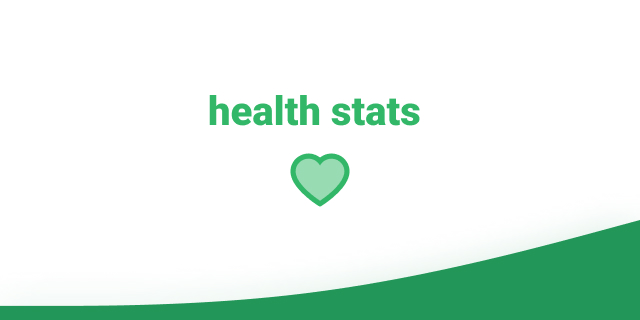

# Health Stats

## Descrição do projeto

Este projeto surgiu há 1 ano, com o objetivo de praticar conhecimentos em React Native. A aplicação tem como objetivo apresentar algumas métricas de saúde, baseadas na altura e peso do usuário. Atualmente vem sendo retomado aos poucos, desta vez com o objetivo refatorar seu código, aprimorando sua construção e organização.

### Funcionalidades

Calcular:
<ul>
	<li>IMC</li>
	<li>Massa Magra</li>
	<li>Massa Gorda</li>
	<li>Peso Ideal</li>
</ul>

### 🛠 Tecnologias

As seguintes ferramentas estão sendo usadas no desenvolvimento do projeto:

- [JavaScript](https://www.javascript.com/)
- [Expo](https://expo.io/)

## 📝 Licença 

Esse projeto está sob licença MIT.

## Mostre seu apoio

Dê uma ⭐️ se esse projeto te ajudou!
